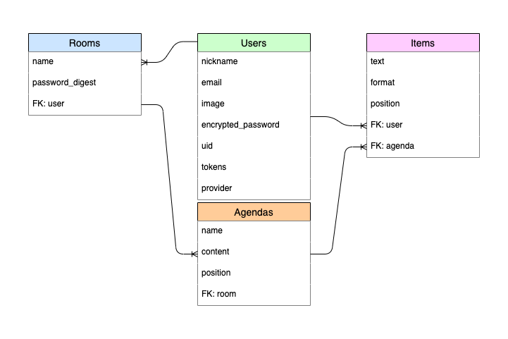
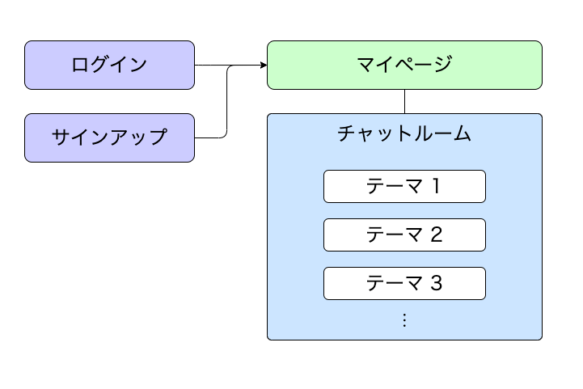

# アプリケーション名
<span style="font-size: 300%">River</span>

# アプリケーション概要
- オンライン会議で使用するチャットアプリです。

- 投稿された意見などを、見出し機能や並び替え機能で構造化しながら議論できます。

- すべての操作が画面更新なしで同期されるため、共同でクラウドノートを編集するようなイメージで利用できます。

# デモサイト
- URL: [https://river-test2-37275.herokuapp.com](https://river-test2-37275.herokuapp.com/)
- 現在はPCのみ対応です。
- Google Chrome最新版でのご利用をお願いします。


# テストアカウント
- メールアドレス： test01@test.com
- パスワード： 123456

  ※ Googleアカウントによるログインも可能ですが、退会機能が未実装のためテストアカウントでのログインをお願いいたします。

# 利用方法
## チャットルームの作成
- ユーザー登録後、チャットルームを作成できます。

  ※ デモサイトでは、ログイン後に全ユーザー共通のチャットルームへ遷移します

## テーマ（議題）の作成
- チャットルームでは、テーマ（議題）を作成することができます。

- テーマごとにチャットを投稿できるため、チャット一覧が整理され、会議後に見返す場合も便利です。

  [](https://gyazo.com/d298d1294556cc315d31cc6cac8ce08c)

## チャットの投稿
- テーマを選択後、チャット入力欄からチャットを入力できます。

  [](https://gyazo.com/5da209bbd8589d6125ad31a8a5e2966d)

- もしくは、任意のチャットのすぐ下に新規チャットを挿入することもできます。
  [](https://gyazo.com/fd263512de7a56d38615df0e00104d19)

## チャットの編集
- 投稿したチャットを編集・削除することができます。
  [](https://gyazo.com/01636e0ac3d88d5582ae40a6e58ffc22)

- 投稿したチャットの見た目を変えたり、並び替えることで、投稿された意見を構造化することができます。
  [](https://gyazo.com/754a0f894c4db349a9b193369f07c4ab)
  [](https://gyazo.com/4636ac1e2a7896b037487bd8284b35f0)

# アプリケーション作成の背景
- オンライン会議は、対面での会議と比べて「やりづらい」と感じていました。

- ファシリテーターがうまく立ち回らないと、話をしすぎたり、反対に意見をほとんど出さない人がでやすい印象です。

- そこで、参加者全員の意見をあつめたい場合は、各自の意見をテキストで投稿し、可視化してから議論する方法が有効でした。

- 作成したアプリケーションでは、上記のようなケースを想定し、話題の確認や意見の投稿、意見の整理や合意形成をサポートするツールを目指しました。

# 実装予定の機能
- テストコード
- いいね機能
  - 会議中の投票機能としても利用
- チャットルームの個別URL・パスワード機能
- マイページ
  - ルームの作成・編集・削除
  - ルームの一覧表示
  - ユーザー情報の編集
  - 退会機能
- ユーザー画像
- 議事録出力機能

# データベース設計


# 画面遷移図


# 開発環境
- Vue 3
- Ruby on Rails 6
- MySQL
- RSpec
- Jest
- Heroku
- AWS（移行予定）
- GitHub
- VSCode

# ローカルでの動作方法
```bash
% git clone https://github.com/8hatch8/River-app_02

# Rails
% cd rails
% bundle install
% yarn install
% bundle exec rails s

# Vue
% cd ../vue
% npm install
% npm run serve-dev
```

# 工夫したポイント
- 「オンラインチャット」と「共同編集できるクラウドメモ」の良いところを掛け合わせました。

- リアルタイムな共同編集を実現しやすくするため、バックエンドはRailsのAPIモード、フロントエンドはVue.jsを採用しました。

- シングルページアプリケーションにすることで、UX向上を目指しました。

- Vueではコンポーネント設計を工夫し、コンポーネント間のデータフローをシンプルにすることを心がけました。

- RailsではAPI設計に力をいれ、拡張性の高いエンドポイントやレスポンスを意識しました。